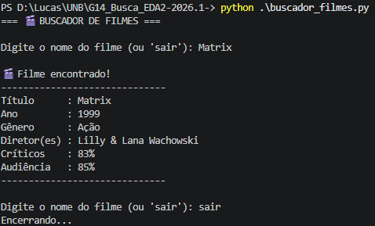
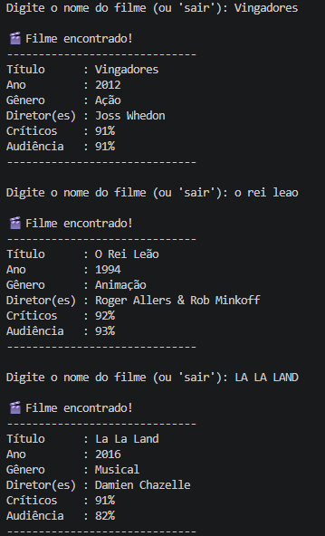
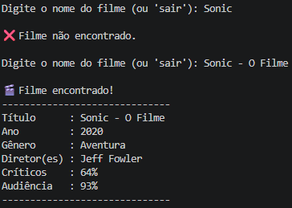

# Buscador de Filmes com Tabela Hash

Número da Lista: 14<br>
Conteúdo da Disciplina: Algoritmos de Busca<br>

## Alunos
|Matrícula | Aluno |
| -- | -- |
| 21/1030925  |  Amanda Gonçalves Sobrinho Abreu |
| 19/0112093  |  Lucas Freire Lopes |

## Sobre 
Este projeto implementa um sistema de busca de filmes utilizando uma **tabela hash construída manualmente**, sem o uso de estruturas prontas como `dict` para armazenamento.

## Screenshots






## Instalação 
Linguagem: Python<br>

- Python 3 instalado

#### Executar o programa

```bash
python buscador_filmes.py
```

## Uso 
Apenas insira o nome do filme que deseja pesquisar na tabela, e ele irá retornar seu nome, ano de lançamento, gênero, diretor(es), e as notas de críticos e audiência publicadas no website Rotten Tomatoes. Quando terminar, basta digitar "sair" para encerrar o programa.

## Outros

Diferenças de Maíusculo/minusculo e acentos entre a entrada e a tabela são ignoradas, mas é necessário escrever o título inteiro do filme.
