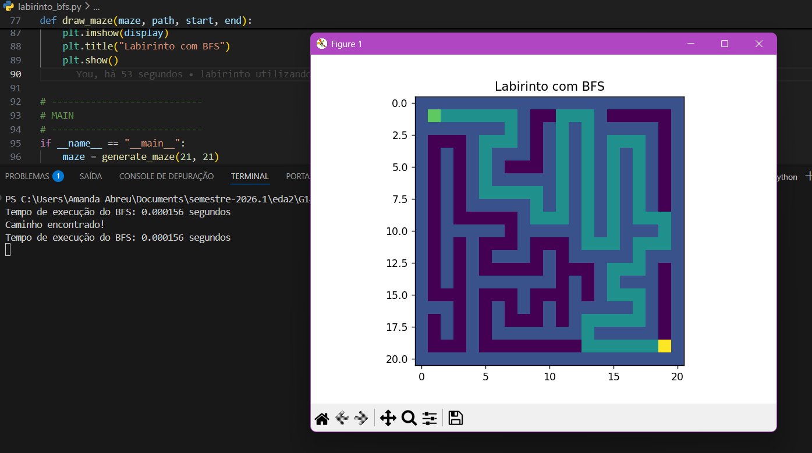

# G14_Busca_EDA2-2026.1-

# Labirinto com BFS (Busca em Largura)

Este projeto implementa a geração de um labirinto aleatório e a busca de caminho utilizando o algoritmo **BFS (Breadth-First Search)** em Python. Também inclui visualização do labirinto e do caminho encontrado utilizando **matplotlib**.

## Funcionalidades

- Geração de labirinto aleatório
- Algoritmo de busca BFS para encontrar o menor caminho
- Visualização gráfica do labirinto
- Marcação do caminho encontrado
- Medição do tempo de execução do algoritmo


## Algoritmos utilizados

### Geração do labirinto
- Algoritmo: **DFS com backtracking**
- Característica: gera um labirinto perfeito (sem ciclos e sem áreas isoladas)

### Busca de caminho
- Algoritmo: **BFS (Breadth-First Search)**
- Garantia: encontra o menor caminho em número de passos


## Requisitos

- Python 3.x
- Biblioteca matplotlib

Instalação:

```bash
pip install matplotlib
```

## Execução

```bash
python labirinto_bfs.pyb
```
